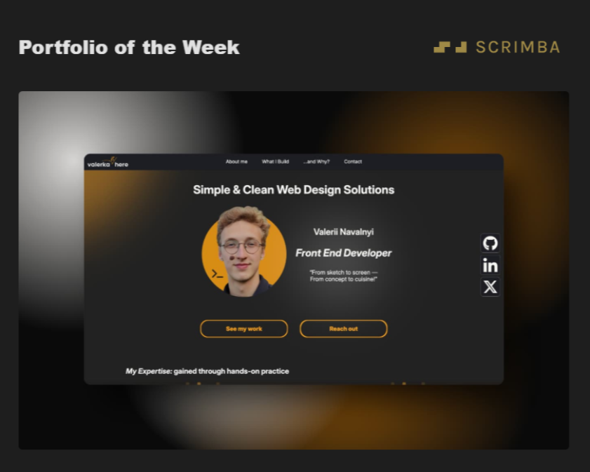

## Well,

  

<h3 align="center">
  See my
  <em>best projects</em>
  on my
</h3>

  

<h3 align="center">
  <em>Connect</em> with me on
</h3>

  

<h3 align="center">
  Looking to apply
  <em>Git Fundamentals</em>
  in 
  <em>VS Code</em>
  ?

  Check out my 1-hour guide below 👇
</h3>

  

<h3 align="center">
Proud to be
 
<a href="https://www.linkedin.com/pulse/big-week-packed-updates-scrimba-2bomf/" target="_blank" rel="noopener noreferrer">
🏆"Portfolio of the Week" Winner at Scrimba🏆
</a>
</h3>

  

  

## So, who am I?
<h4 align="center" >Design Engineer | Aspiring Open Source Contributor | Software Development Student</h4>

-   💻 **Currently:** Looking for opportunities for contributing to an Open Source project as a part of 
- 💫**Result**: [my first Github issue](https://github.com/streetwriters/notesnook/issues/8807) — for Notesnook — *was solved and closed*, contributing to Notesnook development!
-   🎓 **Degree:** A full-time *Software Development student* at Atlantic Technological University (ATU) Sligo. Diving deep in .NET MAUI and Angular!
-   🎙️ **Work:** A *freelance Interpreter* at Translit, ensuring nothing gets lost in translation.
-   🌱 **Learning:** Always diving deeper into Front End at [Scrimba](https://scrimba.com/?via=u430bb90), learning how to build modern and accessible UIs, therefore creating satisfying UXs.

## What I do?

My career is a story of two worlds: 
- On one hand, I'm a developer *obsessed with building clean, logical, modern UI/UX* for the Web with *Astro* and *Core Web Technologies* (HTML, CSS, JS).
- On the other, I'm a *professional interpreter* thriving on the precision required in high-stakes legal settings like courtrooms and tribunals.

I believe the same core skills drive success in both fields: a meticulous attention to detail, clarity under pressure, and the ability to bridge complex communication gaps. The only difference is the type of syntax error you're trying to prevent... and its impact :)

I also believe in *power of free education and software*, which led me to starting my own YouTube channel. Open Source is what truly made me who I am know — person aspiring to help others to ultimately become **better, together**.

---

### My Tools & Areas of Expertise

| Front-end Workflow | CSS Frameworks | JS Frameworks | Desktop Apps | Environment & Tools |
| :--- | :--- | :--- | :--- | :--- |
|  |  |  |  |    |
|   | |  |  |    |
|  |  |      |  | |
| |  | | |   |

---

### Explore My Work

You'll find my main projects pinned below, but here are the highlights:

- [**Velouross — Custom Brand Website**](https://www.velouross.com/): The powerfulness of Figma-to-Code workflow. Clean Figma prototype thanks to close communication with designer: from idea to implementation *in just 2 days*.
-   [**Automated Media File Sorter**](https://github.com/valerkahere/sorter): Tired of a chaotic photo folder? I wrote a powerful Bash script that leverages `ExifTool` to sort thousands of files chronologically in seconds.
-   [**OOP Fleet Management System**](https://github.com/valerkahere/OOP-Fleet-Management-System): An exploration into the depths of Object-Oriented Programming, building a complete vehicle management system from the ground up in C#.

---

### Random Thought 🧠

A syntax error in C# gives you a compiler warning. A "syntax error" in a courtroom... well, the consequences are a bit different. It's taught me to be *very* careful with my logic.
