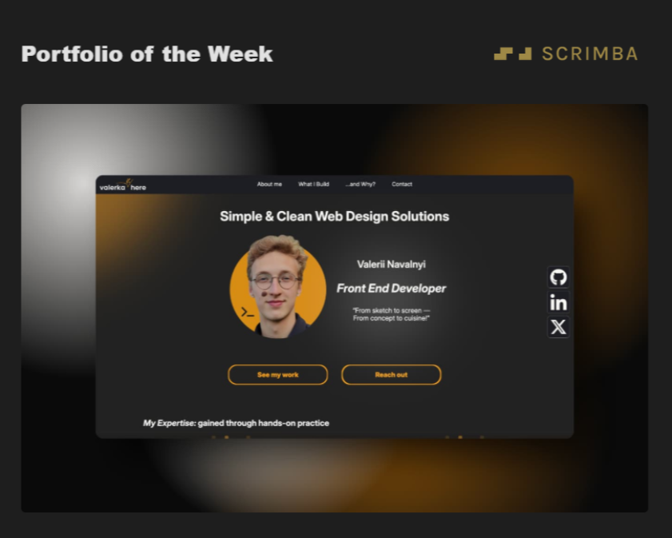
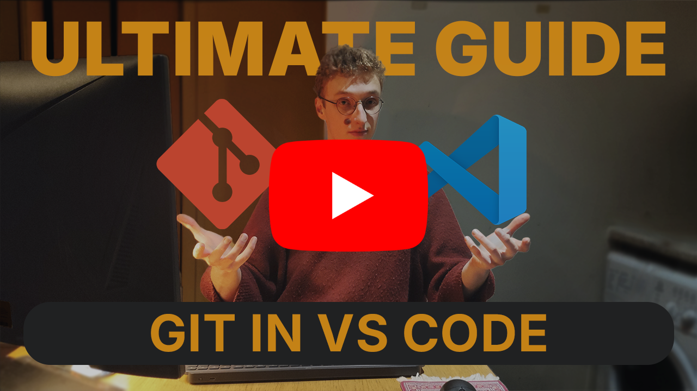
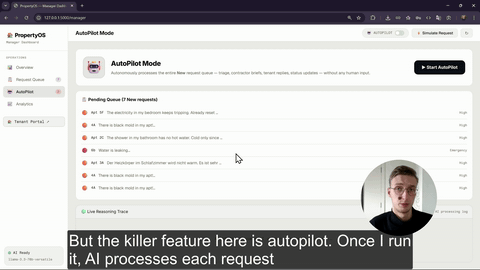
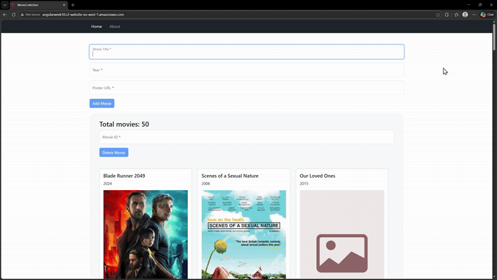

  

 

  
  

<h1 align="center">
    Full-Stack Developer · UI/UX Enthusiast · Precision Thinker
</h1>

> Building end-to-end web products — **from Figma prototype to deployed, Dockerised server**.  
> My background in high-stakes legal interpretation means **I communicate clearly with clients, designers, and teams** — and I write code the same way: precise, unambiguous, and built to be understood.

## 🏆 Recognition

<h3 align="center">
  <a href="https://www.linkedin.com/pulse/big-week-packed-updates-scrimba-2bomf/" target="_blank" rel="noopener noreferrer">
    "Portfolio of the Week" — Scrimba Newsletter
  </a>
</h3>

  

<h3 align="center">
  Hackathon Winner — AI Agent in Under 5 Hours
</h3>

  **March 2026 · [View on LinkedIn →](https://www.linkedin.com/feed/update/urn:li:activity:7436722049613561856/)**

  My first hackathon. My team built a **fully-fledged AI agent for property managers**, from zero to working demo — in under 5 hours. We placed in the **winning tier**.

  That project became [**PropertyManagerOS**](#projects).

## Currently

- 📍 Full-time **Software Development student** at ATU Sligo — deep in **.NET MAUI** and **Angular**
- 🔍 Actively looking for: **internship**, **junior full-stack role**, or **hackathon teams**
- 💡 Open-source contributor — [my first issue on Notesnook was solved and merged](https://github.com/streetwriters/notesnook/issues/8807)
- 🎙️ Freelance interpreter at Translit (Ukrainian/Russian ↔ English — courtrooms, tribunals)
- 📺 YouTuber — making dev education accessible

## Highlight: Git in VS Code — 1-Hour Beginner Guide

  

## Projects

### PropertyManagerOS — AI Property Operations Dashboard
**`Flask` · `Node.js` · `Tailwind CSS` · `AI/LLM APIs` · `Voice API`**

> Built at a winning hackathon in under 5 hours, in a team of 3.

  

---

AI-powered maintenance triage system featuring **AutoPilot Mode**, **Voice Input**, **live streaming**, and **contractor brief export**. Designed for real property managers to cut response time on maintenance requests.

**[→ View Repository](https://github.com/valerkahere/PropertyManagerOS)**

---

### MovieCollection — Full-Stack MEAN CRUD App
**`MongoDB` · `Express.js` · `Angular` · `Node.js` · `AWS`**

  

---

Full-stack web app using the complete MEAN stack. Browse and manage movies against MongoDB's `sample_mflix` dataset. Clean REST API with Angular frontend, deployed with AWS.

**[→ View Repository](https://github.com/valerkahere/movie-collection)**

---

### Velouross — Brand Website
**`Astro` · `Bootstrap` · `Figma` · `HTML/CSS` · `JavaScript`**

  

---

Figma-to-code in **2 days**. Built from a clean designer prototype via close collaboration — pixel-perfect, production-deployed, and live.

**[→ Live Site](https://www.velouross.com/)**

---

### Velouross CMS — Production Self-Hosted Backend
**`Docker` · `Directus` · `PostgreSQL` · `Redis` · `DigitalOcean VPS`**

> Full backend ownership — provisioned, deployed, and maintaining a production CMS.

Self-hosted on DigitalOcean via Docker Compose: Directus CMS + PostgreSQL database + Redis cache. Ongoing maintenance responsibility — this is not a tutorial project.

**[→ CMS Login](https://cms.velouross.com/admin/login)**

---

### Automated Media File Sorter
**`Bash` · `ExifTool` · `Linux`**

Sorts thousands of media files chronologically in seconds by extracting EXIF metadata. Zero dependencies beyond ExifTool. The kind of tool I built because I actually needed it.

**[→ View Repository](https://github.com/valerkahere/sorter)**

---

###  OOP Fleet Management System
**`C#` · `.NET` · `OOP Design Patterns`**

Complete vehicle management system built ground-up in C# — exploring inheritance, polymorphism, and encapsulation in a real domain model.

**[→ View Repository](https://github.com/valerkahere/OOP-Fleet-Management-System)**

## Stack

### Full-Stack
| Layer | Technologies |
| :--- | :--- |
| **Frontend** | HTML5 · CSS3 · JavaScript · TypeScript |
| **Frameworks** | Astro · Angular · Node.js + Express.js |
| **Styling** | Tailwind CSS · Bootstrap · SASS |
| **Backend** | Node.js · Express · REST APIs |
| **Databases** | MongoDB · PostgreSQL · Redis |
| **Desktop** | C# · .NET · .NET MAUI |

### DevOps & Tooling
| Area | Technologies |
| :--- | :--- |
| **Deploy & Infra** | Docker · DigitalOcean VPS · Vercel |
| **Dev Tooling** | Git · Linux · GNU Bash · VS Code |
| **Design** | Figma (design-to-code workflow) |
| **Media** | OBS Studio |

## 🧠 Random Thought

A syntax error in C# gives you a compiler warning.  
A "syntax error" in a courtroom... the consequences are a bit different.  
It's taught me to be *very* careful with my logic — in both languages.

## Some Stats👀

## 🔗 Links

  
  &nbsp;
  
  &nbsp;
  

