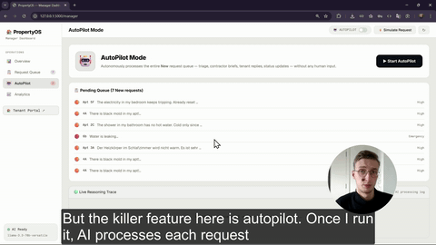
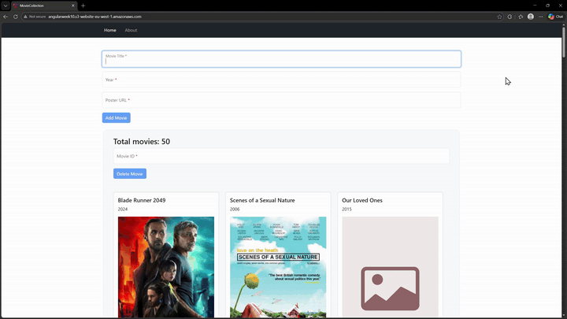
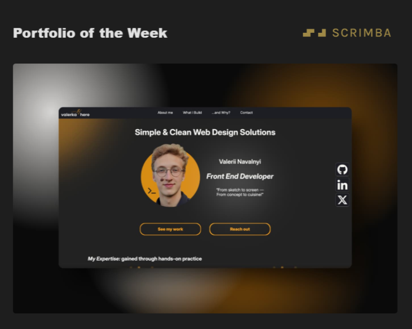
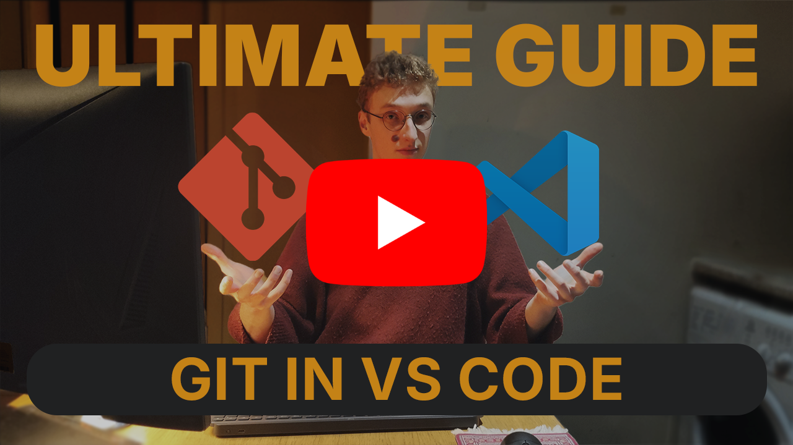

  

 

  
  

<h1 align="center">
    Full-Stack Developer · Linux, Docker & Cloud Infrastructure
</h1>

> I am building web products end-to-end  — **from Figma prototype to deployed, Dockerised server**. Ready to apply my work ethic to solving business IT problems, be it a bespoke website, an internal dashboard, or a backup system.

> My 2-year experience in legal interpretation taught me to **communicate clearly with clients, designers, and teams**. I catch the details in the requirements, perfecting and perfecting the spec, because *practice makes perfect* and the spec (i.e what you want software to do) is Source of Truth.

> Since nowadays we more often consider not *"how"* to build something, but *"what"* problem to solve.

## Projects

### PropertyManagerOS — March 2026 Hackathon Winner

**`Flask` · `SQLite` · `Node.js` · `Tailwind CSS` · `AI/LLM APIs` · `Voice API`**

  

---

Property Managers **get thousands of tenants requests per week**. It was my first hackathon, where we built a triage maintenance platform, which cut the response time and mental burden on those simple template emails like "When are my bins taken out?". **From zero to working demo — in 5 hours**.
- It features **AI-response generation**, **dashboard overview**, **AutoPilot Mode**, **Voice Input** and **live streaming**.
- For the prototype, backend built in Flask, frontend in HTML, JS, Tailwind, and SQLite for data storage.
- **We secured one of the winning spots.** View the Linkedin post to find out more.

**[View Repository](https://github.com/valerkahere/PropertyManagerOS) · [View on LinkedIn](https://www.linkedin.com/feed/update/urn:li:activity:7436722049613561856/)**

---

### MovieCollection — Full-Stack MEAN CRUD App

**`MEAN` · `MongoDB` · `Express.js` · `Angular` · `Node.js` · `AWS`**

  

---

Full-stack web app using the complete MEAN stack. Browse and manage movies against MongoDB's `sample_mflix` dataset. Clean REST API with Angular frontend, deployed on AWS.

**[ View Repository](https://github.com/valerkahere/movie-collection)**

---

### Velouross — Brand Website

**`Astro` · `Bootstrap` · `Figma` · `HTML/CSS` · `JavaScript`**

  

---

Built via close collaboration, with a designer. First in figma, then in code, by me. My figma-to-code structured workflow **achieved the result which made all stakeholders happy, without any rework**.  

*The 1-10-100 Cost of Quality Rule* at its best. It's cheaper to fix inconsistencies in design early on, rather than in the codebase.

**[ Live Site](https://www.velouross.com/)**

---

### Velouross CMS — Production Self-Hosted Backend

**`Docker` · `Directus` · `PostgreSQL` · `Redis` · `DigitalOcean VPS`**

 Full backend ownership — provisioned, deployed, and maintained a production CMS.

- **Self-hosted on DigitalOcean via Docker Compose:** Directus CMS + PostgreSQL database + Redis cache. 
- **Configured Linux server:** Firewall Rules, SSH access, weekly updates, cron jobs, telegram notifications, new user creation, bot protection. 
- **Successfully Performed backup restore testing:** proved the system reliability with business data safe.

---

### Automated Media File Sorter

**`Bash` · `ExifTool` · `Linux`**

Sorts thousands of media files chronologically in seconds by extracting EXIF metadata. Zero dependencies beyond ExifTool. The kind of tool I built because I actually needed it.

**[ View Repository](https://github.com/valerkahere/sorter)**

---

### OOP Fleet Management System

**`C#` · `.NET` · `OOP Design Patterns`**

Complete vehicle management system built ground-up in C# — exploring inheritance, polymorphism, and encapsulation on an extensive domain model.

**[ View Repository](https://github.com/valerkahere/OOP-Fleet-Management-System)**

---

<h3 align="left">
  <a href="https://www.linkedin.com/pulse/big-week-packed-updates-scrimba-2bomf/" target="_blank" rel="noopener noreferrer">
    "Portfolio of the Week" — Scrimba Newsletter Recognition
  </a>
</h3>

  

Portfolio is no feat of a project :D but damn, I like my custom colour scheme, and it seems like Scrimba does, too. There is still a long way to go, though!

## Currently, more about me

- 📍 Full-time **Software Development student** at ATU Sligo — deep in **NestJS** and **Angular**
- 🔍 Actively looking for: **internship**, **junior full-stack role**, or **hackathon teams**
- 💡 Open-source contributor — I love to give back to great software project which I and the wider community benefit from:
  - [my first issue for Notesnook](https://github.com/streetwriters/notesnook/issues/8807) was solved
   - for Directus:
      - [My first PR for Directus CMS](https://github.com/directus/directus/commit/dc825546578f256b4de104532b29c24bb3956a3b) was merged by maintainers
      - [Opened another issue](https://github.com/directus/directus/issues/27678)
      - Proceeded to solve it, the [Vue.js layout bug](https://github.com/directus/directus/pull/27681)
- 🎙️ Freelance interpreter at Translit (Ukrainian/Russian ↔ English — courtrooms, tribunals)
- 📺 YouTuber, making dev education a wee bit more accessible

## Highlight: Git in VS Code — 1-Hour Beginner Guide (a bit of my video-making hobby)

  

## Stack

### Full-Stack

| Layer          | Technologies                           |
| :------------- | :------------------------------------- |
| **Frontend**   | HTML5 · CSS3 · JavaScript · TypeScript |
| **Frameworks** | Astro · Angular · Node.js + Express.js |
| **Styling**    | Tailwind CSS · Bootstrap · SASS        |
| **Backend**    | Node.js · Express · REST APIs          |
| **Databases**  | MongoDB · PostgreSQL · Redis           |
| **Desktop**    | C# · .NET · .NET MAUI                  |

### DevOps & Tooling

| Area               | Technologies                     |
| :----------------- | :------------------------------- |
| **Deploy & Infra** | Docker · AWS · Vercel · Coolify  |
| **Dev Tooling**    | Git · Linux · GNU Bash · VS Code |
| **Design**         | Figma (design-to-code workflow)  |
| **Media**          | OBS Studio                       |

## Random Thought

A syntax error in C# gives you a compiler warning.  
A "syntax error" in a courtroom... well the consequences are a bit different.  
It's taught me to be _very_ careful with my logic, in both languages...

## 🔗 Links

  
  &nbsp;
  
  &nbsp;
  

